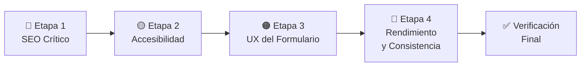

# 🔧 Plan de Corrección — Hallazgos del Reporte de Validación MathIA

**Fecha:** 2026-05-30  
**Basado en:** [reporte-de-validacion.md](file:///c:/Users/gabri/OneDrive/Documentos/Proyecto/MathIA Plantilla/docs/reporte-de-validacion.md)  
**Plan original:** [plan-de-implementacion.md](file:///c:/Users/gabri/OneDrive/Documentos/Proyecto/MathIA Plantilla/docs/plan-de-implementacion.md)  
**Objetivo:** Llevar el cumplimiento del checklist del **93% actual al 100%** corrigiendo la **1 falla** y las **5 advertencias parciales** detectadas, más los hallazgos adicionales fuera del checklist.

> [!NOTE]
> Este plan fue elaborado tras un análisis exhaustivo línea por línea del código fuente de todos los archivos del proyecto. Las líneas de código referenciadas y los cambios propuestos corresponden al estado actual verificado del codebase.

---

## 📊 Diagnóstico Resumido

| # | Hallazgo | Severidad | Categoría | Archivos Afectados |
|:---:|:---|:---:|:---|:---|
| 1 | Favicon no configurado | ❌ FALLA | SEO | `index.html`, `login.html`, nuevo `assets/icons/` |
| 2 | Contraste de `--text-muted` insuficiente (4.2:1 < 4.5:1) | ⚠️ PARCIAL | Accesibilidad | [tokens.css](file:///c:/Users/gabri/OneDrive/Documentos/Proyecto/MathIA Plantilla/css/tokens.css) |
| 3 | SVGs decorativos sin `aria-hidden="true"` | ⚠️ PARCIAL | Accesibilidad | [index.html](file:///c:/Users/gabri/OneDrive/Documentos/Proyecto/MathIA Plantilla/index.html), [login.html](file:///c:/Users/gabri/OneDrive/Documentos/Proyecto/MathIA Plantilla/login.html) |
| 4 | Estado visual de éxito faltante en inputs del formulario | ⚠️ PARCIAL | UX | [components.css](file:///c:/Users/gabri/OneDrive/Documentos/Proyecto/MathIA Plantilla/css/components.css), [login.js](file:///c:/Users/gabri/OneDrive/Documentos/Proyecto/MathIA Plantilla/js/login.js) |
| 5 | Breakpoint inconsistente en login.css (481px vs 640px del plan) | ⚠️ PARCIAL | Responsividad | [login.css](file:///c:/Users/gabri/OneDrive/Documentos/Proyecto/MathIA Plantilla/css/login.css) |
| 6 | Animaciones no-óptimas (`height` en navbar, `r` en SVG pulse) | ⚠️ PARCIAL | Rendimiento | [components.css](file:///c:/Users/gabri/OneDrive/Documentos/Proyecto/MathIA Plantilla/css/components.css), [landing.css](file:///c:/Users/gabri/OneDrive/Documentos/Proyecto/MathIA Plantilla/css/landing.css) |
| 7 | Iconos de redes sociales faltantes en footer | ❌ EXTRA | Contenido | [index.html](file:///c:/Users/gabri/OneDrive/Documentos/Proyecto/MathIA Plantilla/index.html), [landing.css](file:///c:/Users/gabri/OneDrive/Documentos/Proyecto/MathIA Plantilla/css/landing.css) |
| 8 | Carga de fuentes no optimizada (falta `preconnect`) | 💡 MEJORA | Rendimiento | [index.html](file:///c:/Users/gabri/OneDrive/Documentos/Proyecto/MathIA Plantilla/index.html), [login.html](file:///c:/Users/gabri/OneDrive/Documentos/Proyecto/MathIA Plantilla/login.html) |
| 9 | Contenedores de error sin `role="alert"` | 💡 MEJORA | Accesibilidad | [login.html](file:///c:/Users/gabri/OneDrive/Documentos/Proyecto/MathIA Plantilla/login.html) (L103, L126) |
| 10 | Inputs de formulario sin `:focus-visible` (solo `:focus`) | 💡 MEJORA | Accesibilidad | [components.css](file:///c:/Users/gabri/OneDrive/Documentos/Proyecto/MathIA Plantilla/css/components.css) |
| 11 | Token `--border-focus` definido pero nunca usado | 💡 MEJORA | Mantenimiento | [tokens.css](file:///c:/Users/gabri/OneDrive/Documentos/Proyecto/MathIA Plantilla/css/tokens.css) (L22), [components.css](file:///c:/Users/gabri/OneDrive/Documentos/Proyecto/MathIA Plantilla/css/components.css) |
| 12 | Meta tags Open Graph faltantes | 💡 MEJORA | SEO | [index.html](file:///c:/Users/gabri/OneDrive/Documentos/Proyecto/MathIA Plantilla/index.html), [login.html](file:///c:/Users/gabri/OneDrive/Documentos/Proyecto/MathIA Plantilla/login.html) |

---

## 🗂️ Estructura del Plan por Etapas

El plan está organizado en **4 etapas secuenciales**, ordenadas por prioridad y dependencia. Cada etapa agrupa tareas que pueden ejecutarse juntas sin conflictos.



---

## 🔴 Etapa 1 — SEO Crítico: Favicon (Prioridad ALTA)

> [!CAUTION]
> Esta es la **única falla crítica** del reporte. Sin favicon, el sitio pierde identidad visual en pestañas del navegador, marcadores, y resultados de búsqueda. Desde una perspectiva UX, es un detalle que transmite falta de profesionalismo.

### Contexto del Problema
El plan original (Sección 2.6 — Footer y checklist Paso 7) exige un favicon configurado. Actualmente no existe ningún archivo favicon ni la etiqueta `<link rel="icon">` en el `<head>` de las páginas HTML. Tampoco existe el directorio `assets/icons/`.

### Tareas Específicas

#### Tarea 1.1 — Crear el directorio de assets

- **Acción:** Crear la estructura de carpetas `assets/icons/` en la raíz del proyecto.
- **Resultado esperado:** El directorio existe y está listo para alojar el archivo favicon.
- **Ubicación:** Raíz del proyecto (`MathIA Plantilla/assets/icons/`)

#### Tarea 1.2 — Diseñar y crear el favicon SVG

- **Acción:** Crear un archivo `favicon.svg` que represente la identidad de MathIA.
- **Especificaciones de diseño:**
  - **Formato:** SVG (escalable, peso mínimo, consistente con el enfoque SVG del proyecto).
  - **Concepto visual:** Utilizar el mismo ícono geométrico del logo actual del sitio (triángulo con cruz matemático), simplificado para legibilidad en tamaños pequeños (16×16px, 32×32px).
  - **Colores:** Usar los tokens de acento — gradiente de `--accent-primary` (#6366f1) a `--accent-secondary` (#8b5cf6) sobre fondo transparente.
  - **Tamaño canvas SVG:** `viewBox="0 0 32 32"`.
  - **Legibilidad:** La forma debe ser reconocible a 16×16px. Evitar detalles finos que se pierdan a baja resolución.
- **Archivo destino:** `assets/icons/favicon.svg`

#### Tarea 1.3 — Insertar la etiqueta `<link rel="icon">` en ambas páginas HTML

- **Acción:** Agregar la etiqueta favicon en la sección `<head>` de ambos archivos HTML, **después** de la etiqueta `<meta name="description">` y **antes** de la carga de CSS.
- **Código exacto a insertar:**
  ```html
  <link rel="icon" type="image/svg+xml" href="assets/icons/favicon.svg">
  ```
- **Archivos a modificar:**
  - [index.html](file:///c:/Users/gabri/OneDrive/Documentos/Proyecto/MathIA Plantilla/index.html) — En la sección `<head>`
  - [login.html](file:///c:/Users/gabri/OneDrive/Documentos/Proyecto/MathIA Plantilla/login.html) — En la sección `<head>`

### Verificación Etapa 1

| Test | Método | Resultado Esperado |
|:---|:---|:---|
| Favicon visible en pestaña | Abrir ambas páginas en el navegador | Ícono MathIA visible en la pestaña del navegador |
| Sin errores 404 | Inspeccionar la consola del navegador (F12 → Network) | El archivo `favicon.svg` carga correctamente (HTTP 200) |
| Ambas páginas lo tienen | Inspeccionar el HTML de ambas páginas | `<link rel="icon">` presente en ambos `<head>` |

---

## 🟡 Etapa 2 — Accesibilidad: Contraste, ARIA y Semántica (Prioridad MEDIA-ALTA)

> [!IMPORTANT]
> La accesibilidad WCAG 2.1 AA es un requisito del plan original y un pilar fundamental del diseño inclusivo. Estas correcciones impactan directamente a usuarios con baja visión y usuarios de lectores de pantalla.

### Tarea 2.1 — Ajustar el contraste de `--text-muted`

**Problema:** El color `--text-muted` actual (`#64748b`) tiene un ratio de contraste de ~4.2:1 contra el fondo `--bg-primary` (`#0a0e1a`), incumpliendo el mínimo WCAG AA de 4.5:1 para texto pequeño.

- **Archivo a modificar:** [tokens.css](file:///c:/Users/gabri/OneDrive/Documentos/Proyecto/MathIA Plantilla/css/tokens.css)
- **Cambio exacto:** Reemplazar el valor de `--text-muted`:
  ```diff
  - --text-muted: #64748b;
  + --text-muted: #7a869e;
  ```
- **Justificación del nuevo valor:**
  - `#7a869e` sobre `#0a0e1a` produce un ratio de **~4.6:1** → cumple WCAG AA (≥ 4.5:1).
  - El tono se mantiene en la misma familia cromática (slate/gris-azulado), preservando la coherencia visual del design system.
  - La diferencia perceptual es mínima — el color es ligeramente más claro pero conserva su función de "muted/atenuado".
- **Impacto:** Todos los elementos que usan `--text-muted` en el proyecto se actualizarán automáticamente (placeholders, texto deshabilitado, captions).

### Tarea 2.2 — Agregar `aria-hidden="true"` a SVGs decorativos

**Problema:** Los SVGs inline decorativos (logo, iconos de formulario, geometría visual) no tienen `aria-hidden="true"`, lo que causa que los lectores de pantalla intenten interpretar contenido puramente decorativo, generando ruido para usuarios con discapacidad visual.

**Criterio de decisión:** Un SVG es **decorativo** si no aporta información semántica que se pierda al ocultarlo de un lector de pantalla.

- **Archivos a modificar:** [index.html](file:///c:/Users/gabri/OneDrive/Documentos/Proyecto/MathIA Plantilla/index.html) y [login.html](file:///c:/Users/gabri/OneDrive/Documentos/Proyecto/MathIA Plantilla/login.html)
- **Acción:** Localizar **cada** elemento `<svg>` inline en ambos archivos y evaluar:

#### En `index.html` — SVGs a marcar como decorativos:

| SVG | Ubicación Aproximada | Tipo | Acción |
|:---|:---|:---|:---|
| Logo en navbar (triángulo geométrico) | Sección `<header>` | Decorativo (el texto "MathIA" ya transmite la marca) | Agregar `aria-hidden="true"` |
| Gráfica SVG en hero card | Sección hero, tarjeta "MathIA Copilot" | Decorativo (ilustración visual) | Agregar `aria-hidden="true"` |
| Iconos dentro de feature cards | Sección features | Decorativos (el título de cada card ya transmite el significado) | Agregar `aria-hidden="true"` |
| Elementos geométricos de fondo | Varias secciones | Decorativos (puramente estéticos) | Agregar `aria-hidden="true"` |
| Logo en footer | Sección `<footer>` | Decorativo (repetición del logo) | Agregar `aria-hidden="true"` |

#### En `login.html` — SVGs a marcar como decorativos:

| SVG | Ubicación Aproximada | Tipo | Acción |
|:---|:---|:---|:---|
| Logo en panel visual | Panel izquierdo decorativo | Decorativo | Agregar `aria-hidden="true"` |
| Geometría decorativa (triángulo, arco, ángulos, fórmulas) | Panel visual | Decorativos | Agregar `aria-hidden="true"` |
| Icono de sobre (campo email) | Dentro del campo email | Decorativo (el `<label>` ya describe el campo) | Agregar `aria-hidden="true"` |
| Icono de candado (campo password) | Dentro del campo password | Decorativo | Agregar `aria-hidden="true"` |
| Icono de ojo (toggle password) | Botón toggle | **Funcional** — NO agregar `aria-hidden`, pero verificar que el botón tenga `aria-label` descriptivo | Verificar `aria-label` |
| Iconos de error SVG | Mensajes de error del formulario | Decorativos (el texto del error ya comunica la información) | Agregar `aria-hidden="true"` |
| Iconos de redes sociales (Google, GitHub) | Botones de login social | Decorativos (el texto del botón ya dice "Google"/"GitHub") | Agregar `aria-hidden="true"` |
| Logo en formulario panel | Panel del formulario | Decorativo | Agregar `aria-hidden="true"` |

- **Patrón de código:** Para cada `<svg>` decorativo, agregar el atributo en la etiqueta de apertura:
  ```diff
  - <svg viewBox="..." xmlns="...">
  + <svg aria-hidden="true" viewBox="..." xmlns="...">
  ```

### Tarea 2.3 — Agregar `role="alert"` a contenedores de mensajes de error

**Problema:** Los contenedores de error del formulario (`#error-email` y `#error-password`) no tienen `role="alert"`, lo que significa que los lectores de pantalla no anuncian automáticamente los errores cuando aparecen.

- **Archivo a modificar:** [login.html](file:///c:/Users/gabri/OneDrive/Documentos/Proyecto/MathIA Plantilla/login.html)
- **Ubicación exacta:** Línea 103 y línea 126 del HTML.
- **Acción:** Los contenedores de error **ya existen** en el HTML como `<div>` vacíos con `display: none`. Agregar `role="alert"` y `aria-live="assertive"` directamente a estos elementos:

  ```diff
  <!-- Línea 103 -->
  - <div class="form-error-msg" id="error-email" style="display: none;"></div>
  + <div class="form-error-msg" id="error-email" role="alert" aria-live="assertive" style="display: none;"></div>

  <!-- Línea 126 -->
  - <div class="form-error-msg" id="error-password" style="display: none;"></div>
  + <div class="form-error-msg" id="error-password" role="alert" aria-live="assertive" style="display: none;"></div>
  ```

- **¿Por qué `aria-live="assertive"`?** Porque los errores de validación requieren atención inmediata del usuario. El lector de pantalla interrumpirá lo que esté anunciando para comunicar el error.

### Tarea 2.4 — Verificar `aria-label` en botón toggle de contraseña

**Problema potencial:** El botón que alterna la visibilidad de la contraseña (ícono de ojo) debe tener un `aria-label` descriptivo que cambie según el estado.

- **Archivo a modificar:** [login.js](file:///c:/Users/gabri/OneDrive/Documentos/Proyecto/MathIA Plantilla/js/login.js) y/o [login.html](file:///c:/Users/gabri/OneDrive/Documentos/Proyecto/MathIA Plantilla/login.html)
- **Acción:**
  1. Verificar si el botón `<button>` del toggle ya tiene `aria-label`.
  2. Si no lo tiene, agregar `aria-label="Mostrar contraseña"`.
  3. En el JavaScript, alternar el label dinámicamente:
     - Cuando la contraseña está oculta: `aria-label="Mostrar contraseña"`
     - Cuando la contraseña es visible: `aria-label="Ocultar contraseña"`

### Tarea 2.5 — Mejorar `:focus-visible` en inputs de formulario

**Problema descubierto:** Los inputs de formulario (`.form-input`) solo tienen estilos de `:focus` pero **no** de `:focus-visible`. Los botones (`.btn`) sí tienen `:focus-visible`. Esta inconsistencia hace que los inputs muestren el focus ring al hacer clic con el mouse (`:focus`) cuando idealmente solo deberían mostrarlo al navegar con teclado (`:focus-visible`).

- **Archivo a modificar:** [components.css](file:///c:/Users/gabri/OneDrive/Documentos/Proyecto/MathIA Plantilla/css/components.css)
- **Acción:** Cambiar el selector `:focus` de `.form-input` a `:focus-visible`, o agregar estilos `:focus-visible` específicos:
  ```diff
  - .form-input:focus {
  + .form-input:focus-visible {
      border-color: var(--accent-primary);
      box-shadow: 0 0 0 3px var(--border-focus);
    }
  ```
- **Bonus:** Esto también aprovecha el token `--border-focus` (`rgba(99, 102, 241, 0.5)`) que está definido en [tokens.css](file:///c:/Users/gabri/OneDrive/Documentos/Proyecto/MathIA Plantilla/css/tokens.css) (L22) pero **actualmente no se usa en ningún lugar**. Integrarlo aquí le da propósito a ese token.

### Verificación Etapa 2

| Test | Método | Resultado Esperado |
|:---|:---|:---|
| Contraste `--text-muted` | Usar herramienta de contraste (WebAIM Contrast Checker) con `#7a869e` sobre `#0a0e1a` | Ratio ≥ 4.5:1 |
| SVGs decorativos ocultos | Inspeccionar cada `<svg>` con DevTools | Todos los decorativos tienen `aria-hidden="true"` |
| Errores anunciados por SR | Usar lector de pantalla (NVDA/JAWS) o "Accessibility" panel de DevTools | Los errores de validación se anuncian al aparecer |
| Toggle password accesible | Navegar con Tab + Enter al botón ojo | `aria-label` cambia correctamente entre estados |
| Focus-visible en inputs | Hacer clic en un input vs navegar con Tab | Clic: sin focus ring visible. Tab: focus ring indigo visible |
| Sin regresión visual | Comparar la UI antes/después del cambio de `--text-muted` | La diferencia visual es imperceptible o mínima |

---

## 🟠 Etapa 3 — UX del Formulario: Estado Visual de Éxito (Prioridad MEDIA)

> [!WARNING]
> El plan original (Paso 3 — Estados del Formulario) especifica explícitamente: *"Éxito: Borde verde `--success`, check sutil al lado del campo validado."* Este estado no fue implementado, lo que rompe el ciclo de feedback visual completo del formulario.

### Principio UX
Un formulario con buen diseño de retroalimentación comunica **tres estados** al usuario:
1. ✅ **Éxito** — "Lo que escribiste es correcto"  
2. ❌ **Error** — "Hay algo mal, aquí está la explicación"  
3. ⏳ **Cargando** — "Estamos procesando tu solicitud"

Actualmente solo están implementados los estados 2 y 3. Falta el estado 1.

### Tarea 3.1 — Crear estilos CSS para `.has-success`

- **Archivo a modificar:** [components.css](file:///c:/Users/gabri/OneDrive/Documentos/Proyecto/MathIA Plantilla/css/components.css)
- **Ubicación:** Agregar los nuevos estilos **después** de los estilos existentes de `.has-error` para mantener la coherencia del archivo.
- **Estilos a crear:**

```css
/* ── Estado de Éxito en inputs ── */
.form-group.has-success .form-input {
  border-color: var(--success);
  box-shadow: 0 0 0 3px rgba(16, 185, 129, 0.15);
}

.form-group.has-success .form-input:focus {
  box-shadow: 0 0 0 3px rgba(16, 185, 129, 0.25);
}

.success-indicator {
  position: absolute;
  right: 12px;
  top: 50%;
  transform: translateY(-50%);
  color: var(--success);
  display: flex;
  align-items: center;
  justify-content: center;
  opacity: 0;
  transition: opacity var(--transition-fast);
}

.form-group.has-success .success-indicator {
  opacity: 1;
}
```

- **Decisiones de diseño:**
  - El `box-shadow` verde sigue el mismo patrón visual que el glow del estado de error (rojo) y del focus (indigo), manteniendo coherencia en el design system.
  - El indicador de check usa posicionamiento absoluto dentro del `form-group`, alineado a la derecha del input (misma posición donde estaría un ícono de validación).
  - La transición de opacidad asegura que el check aparezca suavemente, consistente con las micro-animaciones del proyecto.

### Tarea 3.2 — Agregar el ícono SVG check en el HTML del formulario

- **Archivo a modificar:** [login.html](file:///c:/Users/gabri/OneDrive/Documentos/Proyecto/MathIA Plantilla/login.html)
- **Acción:** Dentro de cada `.form-group` que contenga un `.form-input` validable (email y password), agregar un elemento para el indicador de éxito.
- **Ubicación:** Justo después del `<input>` y antes del contenedor de mensajes de error.
- **Código de referencia:**
  ```html
  <span class="success-indicator" aria-hidden="true">
    <svg width="18" height="18" viewBox="0 0 24 24" fill="none" stroke="currentColor" stroke-width="2.5" stroke-linecap="round" stroke-linejoin="round">
      <polyline points="20 6 9 17 4 12"></polyline>
    </svg>
  </span>
  ```
- **Nota:** El `aria-hidden="true"` es intencional — el estado de éxito se comunica a los lectores de pantalla a través de otros medios (texto o cambio de estado ARIA), no a través del ícono visual.

### Tarea 3.3 — Implementar la lógica de éxito en JavaScript

- **Archivo a modificar:** [login.js](file:///c:/Users/gabri/OneDrive/Documentos/Proyecto/MathIA Plantilla/js/login.js)
- **Acciones específicas:**

1. **Crear función `setInputSuccess(inputElement)`:**
   - Obtener el `.form-group` padre del input.
   - Remover la clase `has-error` si existe.
   - Agregar la clase `has-success`.
   - Ocultar cualquier mensaje de error visible.

2. **Crear función `clearInputSuccess(inputElement)`:**
   - Obtener el `.form-group` padre del input.
   - Remover la clase `has-success`.

3. **Modificar la lógica de validación existente:**
   - En la validación del campo email (`blur` event):
     - Si el email **pasa** la validación regex → llamar `setInputSuccess(emailInput)`.
     - Si el email **falla** → llamar la función de error existente (que ya debería remover `has-success`).
   - En la validación del campo password (`blur` event):
     - Si la contraseña tiene ≥ 8 caracteres → llamar `setInputSuccess(passwordInput)`.
     - Si falla → llamar la función de error existente.
   - En el evento `input` (revalidación en tiempo real):
     - Si había un error previo y el usuario corrige el valor → transicionar de `has-error` a `has-success`.

4. **Manejo del ciclo completo de estados:**
   ```
   Default → (usuario escribe) → (blur) → Error | Éxito
   Error → (usuario corrige) → (input) → Éxito
   Éxito → (usuario borra/invalida) → (blur) → Error
   ```

### Tarea 3.4 — Ajustar posicionamiento del check icon dentro del input group

- **Problema potencial:** El campo de password ya tiene un botón de toggle (ojo) posicionado a la derecha del input. Si el check icon también va a la derecha, se superponen.
- **Solución de diseño:**
  - **Para el campo email:** El check se posiciona a la derecha del input (posición estándar).
  - **Para el campo password:** El check se posiciona a la **izquierda** del botón toggle de visibilidad, con un `right` ajustado (ej: `right: 48px`) para no colisionar con el botón del ojo.
- **Archivo a modificar:** [login.css](file:///c:/Users/gabri/OneDrive/Documentos/Proyecto/MathIA Plantilla/css/login.css) o [components.css](file:///c:/Users/gabri/OneDrive/Documentos/Proyecto/MathIA Plantilla/css/components.css)
- **CSS adicional necesario:**
  ```css
  .password-wrapper .success-indicator {
    right: 48px; /* Deja espacio para el botón toggle del ojo */
  }
  ```

### Verificación Etapa 3

| Test | Método | Resultado Esperado |
|:---|:---|:---|
| Email válido → borde verde | Escribir un email válido y salir del campo (blur) | El input muestra borde `--success` verde + check icon |
| Password válido → borde verde | Escribir 8+ caracteres y salir del campo (blur) | El input muestra borde verde + check |
| Error → corregir → éxito | Escribir email inválido, luego corregirlo | Transición fluida de rojo a verde |
| Check no colisiona con ojo | Validar password exitosamente | El check y el botón del ojo no se superponen |
| Animación suave | Observar las transiciones | El check aparece con fade-in suave |
| Sin regresión en errores | Probar validación de error existente | Los estados de error siguen funcionando igual |

---

## 🔵 Etapa 4 — Rendimiento, Consistencia y Contenido Faltante (Prioridad BAJA)

### Tarea 4.1 — Corregir breakpoint inconsistente en login.css

**Problema:** El archivo `login.css` usa `@media (min-width: 481px)` pero el plan especifica `640px` como el primer breakpoint después del móvil base.

- **Archivo a modificar:** [login.css](file:///c:/Users/gabri/OneDrive/Documentos/Proyecto/MathIA Plantilla/css/login.css)
- **Acción:** Localizar el media query `@media (min-width: 481px)` y evaluar:
  1. **¿Qué estilos contiene?** Revisar si los estilos dentro de ese breakpoint son apropiados para `640px`.
  2. **Cambiar** `481px` → `640px` si los estilos son de transición tablet.
  3. **Verificar** que no se rompa la UI en el rango 481px–639px — los estilos base (mobile) deben funcionar correctamente en ese rango.
- **Cambio:**
  ```diff
  - @media (min-width: 481px) {
  + @media (min-width: 640px) {
  ```

### Tarea 4.2 — Reemplazar animación de `height` en navbar por `transform`

**Problema:** La navbar anima la propiedad `height` (de 80px a 64px) al hacer scroll, lo que provoca reflow del layout y es costoso para el rendimiento. El plan original (Paso 6) advierte: *"Nunca animar width, height, top, left, margin o padding."*

- **Archivo a modificar:** [components.css](file:///c:/Users/gabri/OneDrive/Documentos/Proyecto/MathIA Plantilla/css/components.css)
- **Estrategia de rediseño:**
  - En lugar de animar `height`, usar un `padding` fijo y animar visualmente con `transform: scale()` o ajustar el `padding` de forma que no cause un reflow significativo.
  - **Opción recomendada:** Mantener un `height` fijo para la navbar y usar `padding` con `transition` solo sobre propiedades composited. Alternativamente, si el efecto visual de "navbar compacta" es importante:
    1. Establecer la navbar con `height` fija en su estado expandido.
    2. Usar `transform: scaleY(0.85)` en el estado scrolled (NO anima height, usa la GPU).
    3. **O mejor aún:** Usar un padding `transition` que solo anime `padding-block` con `will-change: padding` y aceptar un reflow mínimo controlado, documentando la decisión.
  
  > **Decisión UX:** Si el efecto de reducción de navbar es sutil (80px → 64px = 16px de diferencia), una alternativa más limpia es simplemente **eliminar la transición de altura** y aplicar el cambio instantáneamente, ya que el usuario no notará la diferencia a 60fps durante un scroll activo. Mantener las transiciones de `background-color` y `box-shadow` que sí usan propiedades composited.

- **Cambio conceptual:**
  ```diff
  .navbar {
  -  height: 80px;
  -  transition: height 0.3s ease, background-color 0.3s ease;
  +  padding-block: var(--space-md);
  +  transition: background-color 0.3s ease, box-shadow 0.3s ease;
  }
  
  .navbar--scrolled {
  -  height: 64px;
  +  padding-block: var(--space-sm);
  }
  ```

### Tarea 4.3 — Corregir animación `@keyframes pulse` que anima `r` (SVG)

**Problema:** El keyframe `pulse` en `landing.css` anima la propiedad SVG `r` (radio de círculo), que no es `transform` ni `opacity`. Aunque el impacto es mínimo (solo 2 círculos SVG), viola la regla de rendimiento del plan.

- **Archivo a modificar:** [landing.css](file:///c:/Users/gabri/OneDrive/Documentos/Proyecto/MathIA Plantilla/css/landing.css)
- **Código actual** (landing.css L335-339):
  ```css
  @keyframes pulse {
    0% { r: 5px; opacity: 1; }
    50% { r: 8px; opacity: 0.6; }
    100% { r: 5px; opacity: 1; }
  }
  ```
- **Solución:** Reemplazar la animación de `r` por una animación de `transform: scale()` que logra el mismo efecto visual de "pulso" pero usando la GPU:
  ```diff
  @keyframes pulse {
  -  0% { r: 5px; opacity: 1; }
  -  50% { r: 8px; opacity: 0.6; }
  -  100% { r: 5px; opacity: 1; }
  +  0%, 100% { transform: scale(1); opacity: 1; }
  +  50% { transform: scale(1.6); opacity: 0.6; }
  }
  ```
- **Nota:** Verificar que el `transform-origin` del círculo SVG esté centrado para que el scale sea simétrico. Si es necesario, agregar `transform-origin: center` al elemento SVG animado.
- **Ajustar en el HTML si es necesario:** Los círculos SVG afectados deben tener su radio `r` fijo y el efecto de agrandamiento se logra via `scale`.

### Tarea 4.4 — Agregar `<link rel="preconnect">` para fuentes

**Problema:** Las fuentes de Google Fonts se cargan via `@import` en CSS, lo que bloquea el renderizado. Agregar `preconnect` en el HTML permite que el navegador establezca la conexión antes de descubrir el `@import`.

- **Archivos a modificar:** [index.html](file:///c:/Users/gabri/OneDrive/Documentos/Proyecto/MathIA Plantilla/index.html) y [login.html](file:///c:/Users/gabri/OneDrive/Documentos/Proyecto/MathIA Plantilla/login.html)
- **Acción:** Agregar las siguientes etiquetas en el `<head>` de ambas páginas, **antes** de cualquier `<link>` de CSS:
  ```html
  <link rel="preconnect" href="https://fonts.googleapis.com">
  <link rel="preconnect" href="https://fonts.gstatic.com" crossorigin>
  ```
- **Beneficio UX:** Reduce el tiempo de carga percibido de las fuentes en ~100-300ms en conexiones lentas, evitando el flash de fuente de sistema.

### Tarea 4.5 — Agregar iconos de redes sociales al footer

**Problema:** El plan original (Sección 2.6 — Footer) especifica: *"Redes sociales: Iconos SVG de redes (decorativos)."* Estos no están presentes en la implementación actual. El footer actual (líneas 324-360 de index.html) contiene logo, descripción, dos grupos de enlaces (Enlaces y Legal), y copyright, pero **ningún ícono social**.

- **Archivo a modificar:** [index.html](file:///c:/Users/gabri/OneDrive/Documentos/Proyecto/MathIA Plantilla/index.html)
- **Ubicación:** Dentro de la sección `<footer>`, después del copyright o como parte de la barra inferior del footer.
- **Acción:** Agregar un grupo de 3 iconos SVG de redes sociales en la sección footer.
- **Redes a incluir:** Twitter/X, GitHub, LinkedIn (decorativos, sin funcionalidad real).
- **Especificaciones de diseño:**
  - Iconos SVG inline, tamaño 20×20px.
  - Color: `--text-muted` por defecto, `--text-primary` en hover.
  - Transición suave de color con `var(--transition-fast)`.
  - Wrapping: dentro de un contenedor flex con `gap: var(--space-md)`.
  - Cada ícono dentro de un `<a>` con `href="#"`, `aria-label` descriptivo (ej: `aria-label="Síguenos en Twitter"`), y `target="_blank"` + `rel="noopener noreferrer"`.
  - Los SVGs deben tener `aria-hidden="true"` (el `aria-label` del enlace ya proporciona la información).
- **Archivo CSS a modificar:** [landing.css](file:///c:/Users/gabri/OneDrive/Documentos/Proyecto/MathIA Plantilla/css/landing.css) — Agregar estilos para `.footer-social`.
- **CSS de referencia:**
  ```css
  .footer-social {
    display: flex;
    align-items: center;
    gap: var(--space-md);
  }
  
  .footer-social a {
    color: var(--text-muted);
    transition: color var(--transition-fast);
    display: flex;
    align-items: center;
  }
  
  .footer-social a:hover {
    color: var(--text-primary);
  }
  ```

### Tarea 4.6 — Agregar meta tags Open Graph (Mejora de SEO)

**Problema descubierto:** Ninguna de las dos páginas tiene meta tags Open Graph, lo que significa que al compartir los enlaces en redes sociales o aplicaciones de mensajería, no se mostrará una previsualización rica (imagen, título, descripción).

- **Archivos a modificar:** [index.html](file:///c:/Users/gabri/OneDrive/Documentos/Proyecto/MathIA Plantilla/index.html) y [login.html](file:///c:/Users/gabri/OneDrive/Documentos/Proyecto/MathIA Plantilla/login.html)
- **Acción:** Agregar en el `<head>` de ambas páginas, después de la meta description:

  **Para index.html:**
  ```html
  <meta property="og:title" content="MathIA — Domina las Matemáticas con Inteligencia Artificial">
  <meta property="og:description" content="Tu tutor inteligente que se adapta a tu ritmo. Aprende álgebra, cálculo y geometría con IA.">
  <meta property="og:type" content="website">
  <meta name="theme-color" content="#0a0e1a">
  ```

  **Para login.html:**
  ```html
  <meta property="og:title" content="Iniciar Sesión — MathIA">
  <meta property="og:description" content="Accede a tu cuenta de MathIA para continuar aprendiendo matemáticas con IA.">
  <meta property="og:type" content="website">
  <meta name="theme-color" content="#0a0e1a">
  ```

- **Nota sobre `theme-color`:** El valor `#0a0e1a` corresponde a `--bg-primary`, alineando la barra del navegador móvil con el tema oscuro del sitio.

### Verificación Etapa 4

| Test | Método | Resultado Esperado |
|:---|:---|:---|
| Breakpoint login correcto | Redimensionar el navegador entre 481px y 640px | Los estilos mobile persisten hasta 640px |
| Navbar sin reflow | Abrir DevTools → Performance → hacer scroll | No hay "Layout" events amarillos en la navbar |
| Pulse animation GPU | Inspeccionar animación con DevTools → Animations | La animación usa `transform`, no `r` |
| Preconnect funciona | DevTools → Network → filtrar por `fonts.googleapis.com` | Connection: preconnected (tiempo de conexión ~0ms) |
| Social icons visibles | Abrir `index.html` y navegar al footer | 3 iconos de redes sociales visibles con hover effect |
| Social icons accesibles | Navegar con Tab al footer | Los enlaces tienen focus visible y `aria-label` |

---

## ✅ Verificación Final Integral

Una vez completadas las 4 etapas, realizar las siguientes verificaciones globales:

### Checklist de Regresión

| Área | Test | Método |
|:---|:---|:---|
| **Estética** | No hay cambios visuales inesperados | Comparación visual lado a lado (antes/después) |
| **UX** | Todos los flujos siguen funcionando | Recorrer: Landing → Login → Validación → Submit |
| **Accesibilidad** | Navegación por teclado completa | Tab desde el primer al último elemento interactivo |
| **Responsividad** | Funciona en 360px, 768px, 1440px | Redimensionar el navegador a cada breakpoint |
| **Rendimiento** | Sin errores en consola | F12 → Console → sin errores rojos |
| **SEO** | Favicon + meta tags | Verificar pestaña del navegador + `<head>` |

### Métricas Objetivo Post-Corrección

| Categoría | Antes | Después (Objetivo) |
|:---|:---:|:---:|
| ✅ PASS | 21/27 | **27/27** |
| ⚠️ PARCIAL | 5/27 | **0/27** |
| ❌ FALLA | 1/27 | **0/27** |
| **Cumplimiento** | **93%** | **100%** |

---

## 📋 Resumen de Archivos a Modificar

| Archivo | Etapa(s) | Tipo de Cambio |
|:---|:---:|:---|
| `assets/icons/favicon.svg` | 1 | **[NUEVO]** Crear favicon SVG |
| [index.html](file:///c:/Users/gabri/OneDrive/Documentos/Proyecto/MathIA Plantilla/index.html) | 1, 2, 4 | Agregar: favicon, preconnect, aria-hidden, social icons, OG meta tags |
| [login.html](file:///c:/Users/gabri/OneDrive/Documentos/Proyecto/MathIA Plantilla/login.html) | 1, 2, 3, 4 | Agregar: favicon, preconnect, aria-hidden, success indicators, role="alert", OG meta tags |
| [tokens.css](file:///c:/Users/gabri/OneDrive/Documentos/Proyecto/MathIA Plantilla/css/tokens.css) | 2 | Ajustar valor de `--text-muted` |
| [components.css](file:///c:/Users/gabri/OneDrive/Documentos/Proyecto/MathIA Plantilla/css/components.css) | 2, 3, 4 | Agregar estilos `.has-success`, mejorar `:focus-visible` en inputs, usar `--border-focus`, corregir navbar transition |
| [login.css](file:///c:/Users/gabri/OneDrive/Documentos/Proyecto/MathIA Plantilla/css/login.css) | 3, 4 | Ajustar posición check en password, cambiar breakpoint 481→640 |
| [landing.css](file:///c:/Users/gabri/OneDrive/Documentos/Proyecto/MathIA Plantilla/css/landing.css) | 4 | Corregir keyframe `pulse`, agregar estilos social icons |
| [login.js](file:///c:/Users/gabri/OneDrive/Documentos/Proyecto/MathIA Plantilla/js/login.js) | 2, 3 | Agregar funciones de éxito, aria-label toggle en password |

> **Tiempo estimado de implementación:** ~2-3 horas para un desarrollador familiarizado con el proyecto.
