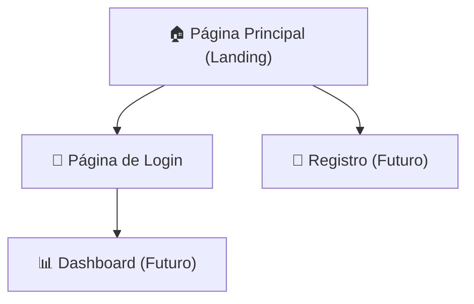
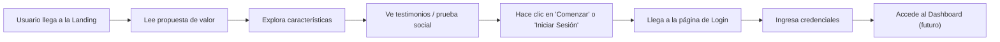

# 📐 Plan de Implementación — MathIA

**Proyecto:** Plataforma educativa de ciencias matemáticas impulsada por IA  
**Alcance:** Página Principal (Landing Page) + Página de Login  
**Tecnologías:** HTML · CSS · JavaScript (Vanilla, sin frameworks)  
**Metodología:** Diseño centrado en el usuario (UX) con estética premium (UI)

> [!NOTE]
> Este plan cubre exclusivamente el **diseño y maquetación visual** de las dos páginas.  
> No incluye lógica de backend, bases de datos, autenticación funcional ni integración de IA.  
> Para la guía completa de capacidades UI/UX del agente, consulta [SKILL.md](file:///c:/Users/gabriel.arcila/Desktop/MathIA/.agents/skills/ui-ux-designer/SKILL.md).

---

## 📑 Tabla de Contenidos

1. [Visión General del Producto](#1--visión-general-del-producto)
2. [Público Objetivo y Personas](#2--público-objetivo-y-personas)
3. [Arquitectura de Información](#3--arquitectura-de-información)
4. [Estructura de Archivos del Proyecto](#4--estructura-de-archivos-del-proyecto)
5. [Sistema de Diseño (Design Tokens)](#5--sistema-de-diseño-design-tokens)
6. [Paso 1 — Fundación CSS Global](#paso-1--fundación-css-global)
7. [Paso 2 — Página Principal (Landing Page)](#paso-2--página-principal-landing-page)
8. [Paso 3 — Página de Login](#paso-3--página-de-login)
9. [Paso 4 — Interactividad con JavaScript](#paso-4--interactividad-con-javascript)
10. [Paso 5 — Responsive Design](#paso-5--responsive-design)
11. [Paso 6 — Pulido y Micro-animaciones](#paso-6--pulido-y-micro-animaciones)
12. [Paso 7 — Validación y Checklist Final](#paso-7--validación-y-checklist-final)
13. [Referencias de Diseño](#referencias-de-diseño)

---

## 1 — Visión General del Producto

**MathIA** es una plataforma web educativa que utiliza inteligencia artificial para ayudar a estudiantes a comprender, practicar y dominar las ciencias matemáticas de forma personalizada e interactiva.

### Objetivos de diseño

| Objetivo | Descripción |
|:---|:---|
| **Impacto visual inmediato** | El usuario debe sentir confianza y profesionalismo al entrar por primera vez. |
| **Claridad sobre el valor** | En menos de 5 segundos, el visitante debe entender qué hace MathIA y por qué es útil. |
| **Conversión fluida** | El camino desde la landing hasta el registro/login debe ser intuitivo y sin fricciones. |
| **Accesibilidad** | Cumplimiento WCAG 2.1 AA en contraste, navegación por teclado y semántica HTML. |

---

## 2 — Público Objetivo y Personas

### Persona Principal: El Estudiante

| Atributo | Detalle |
|:---|:---|
| **Nombre** | Camila, 17 años |
| **Perfil** | Estudiante de bachillerato que necesita reforzar álgebra y cálculo. |
| **Motivación** | Entender los temas de clase a su propio ritmo, sin presión. |
| **Frustraciones** | Los tutoriales en video son largos; las explicaciones de texto no son interactivas. |
| **Dispositivo principal** | Smartphone (móvil primero) y laptop para sesiones largas. |

### Persona Secundaria: El Docente

| Atributo | Detalle |
|:---|:---|
| **Nombre** | Profesor Andrés, 34 años |
| **Perfil** | Docente de matemáticas en educación media que busca herramientas complementarias. |
| **Motivación** | Recomendar a sus alumnos un recurso confiable con respaldo de IA. |
| **Dispositivo principal** | Laptop / Desktop. |

---

## 3 — Arquitectura de Información

### Mapa del sitio (alcance de este plan)



### Flujo de usuario principal (Happy Path)



---

## 4 — Estructura de Archivos del Proyecto

```
MathIA/
├── index.html              ← Página Principal (Landing Page)
├── login.html              ← Página de Login
├── css/
│   ├── tokens.css          ← Variables globales (Design Tokens)
│   ├── reset.css           ← Reset / Normalización base
│   ├── global.css          ← Estilos globales (tipografía, body, utilidades)
│   ├── components.css      ← Estilos de componentes reutilizables (botones, cards, nav)
│   ├── landing.css         ← Estilos específicos de la Landing Page
│   └── login.css           ← Estilos específicos de la página de Login
├── js/
│   ├── main.js             ← Lógica compartida (navbar, tema, scroll)
│   └── login.js            ← Interacciones del formulario de login
├── assets/
│   ├── images/             ← Imágenes generadas y optimizadas
│   ├── icons/              ← Iconos SVG en línea o como archivos
│   └── fonts/              ← Fuentes locales (fallback)
└── docs/
    └── plan-de-implementacion.md   ← Este archivo
```

> [!IMPORTANT]
> Los archivos CSS están separados por responsabilidad (tokens, reset, global, componentes, página) siguiendo el principio de **separación de concerns** y la metodología **Atomic Design** para facilitar el mantenimiento y la escalabilidad.

---

## 5 — Sistema de Diseño (Design Tokens)

### 5.1 Paleta de Colores

La paleta transmite **inteligencia, confianza y modernidad**, con un tono predominante oscuro (dark mode por defecto) y acentos vibrantes que evocan tecnología e innovación.

| Token | Valor | Uso |
|:---|:---|:---|
| `--bg-primary` | `#0a0e1a` | Fondo principal de las páginas |
| `--bg-secondary` | `hsla(225, 30%, 12%, 0.85)` | Tarjetas, paneles con glassmorphism |
| `--bg-tertiary` | `hsla(225, 25%, 16%, 0.6)` | Fondos de inputs, secciones alternas |
| `--accent-primary` | `#6366f1` (Indigo) | Botones principales, enlaces activos |
| `--accent-secondary` | `#8b5cf6` (Violeta) | Gradientes, acentos secundarios |
| `--accent-warm` | `#f59e0b` (Ámbar) | Insignias, destacados, estrellas |
| `--text-primary` | `#f1f5f9` | Texto principal sobre fondos oscuros |
| `--text-secondary` | `#94a3b8` | Texto secundario, descripciones |
| `--text-muted` | `#64748b` | Placeholders, texto deshabilitado |
| `--success` | `#10b981` | Mensajes de éxito |
| `--error` | `#ef4444` | Mensajes de error, validaciones |
| `--border-subtle` | `rgba(255, 255, 255, 0.08)` | Bordes sutiles en tarjetas y paneles |

### 5.2 Tipografía

| Token | Valor | Uso |
|:---|:---|:---|
| `--font-primary` | `'Outfit', sans-serif` | Títulos y texto general |
| `--font-mono` | `'JetBrains Mono', monospace` | Fórmulas, código, datos numéricos |
| `--fs-hero` | `clamp(2.5rem, 5vw, 4rem)` | Título principal del hero |
| `--fs-h2` | `clamp(1.75rem, 3vw, 2.5rem)` | Títulos de sección |
| `--fs-h3` | `1.25rem` | Subtítulos y nombres de tarjetas |
| `--fs-body` | `1rem` (16px) | Texto de párrafo |
| `--fs-small` | `0.875rem` | Etiquetas, captions |

### 5.3 Espaciado, Bordes y Sombras

| Token | Valor |
|:---|:---|
| `--space-xs` | `4px` |
| `--space-sm` | `8px` |
| `--space-md` | `16px` |
| `--space-lg` | `24px` |
| `--space-xl` | `32px` |
| `--space-2xl` | `48px` |
| `--space-3xl` | `64px` |
| `--radius-sm` | `8px` |
| `--radius-md` | `14px` |
| `--radius-lg` | `20px` |
| `--radius-full` | `9999px` |
| `--shadow-card` | `0 8px 32px rgba(0, 0, 0, 0.25)` |
| `--shadow-glow` | `0 0 40px rgba(99, 102, 241, 0.15)` |
| `--transition-fast` | `0.15s ease` |
| `--transition-smooth` | `0.3s cubic-bezier(0.4, 0, 0.2, 1)` |

---

## Paso 1 — Fundación CSS Global

**Objetivo:** Establecer el reset, los tokens de diseño y los estilos base antes de construir cualquier componente.

### Tareas

- [x] **1.1** Crear `css/reset.css` con un CSS Reset moderno (box-sizing, margin, padding, font heredado).
- [x] **1.2** Crear `css/tokens.css` con todas las variables CSS documentadas en la sección 5 de este plan.
- [x] **1.3** Crear `css/global.css` con:
  - Importación de Google Fonts (`Outfit` y `JetBrains Mono`).
  - Estilos base para `body`, `html` (fondo, color, font-family, anti-aliasing).
  - Clases utilitarias de texto (`.text-gradient`, `.text-muted`, `.text-center`).
  - Estilos del scrollbar personalizado (para Webkit y Firefox).
- [x] **1.4** Crear `css/components.css` con los estilos de los componentes reutilizables:
  - **Botón Primario (`.btn-primary`):** Fondo con gradiente `accent-primary → accent-secondary`, bordes redondeados, sombra sutil, hover con elevación y brillo, estado focus-visible.
  - **Botón Secundario (`.btn-secondary`):** Fondo transparente, borde sutil, texto claro, hover con relleno sutil.
  - **Tarjeta (`.card`):** Glassmorphism (`backdrop-filter: blur()`, fondo semi-transparente, borde sutil de 1px), radio de borde `--radius-md`, sombra `--shadow-card`.
  - **Navbar (`.navbar`):** Fija en la parte superior, fondo con `backdrop-filter: blur(12px)` semi-transparente, transición suave al hacer scroll.
  - **Input de formulario (`.form-input`):** Fondo `--bg-tertiary`, borde sutil, transición de borde al focus con color de acento, label flotante o encima del input.
  - **Badge / Tag (`.badge`):** Pequeño indicador con fondo de acento y texto reducido.

> [!TIP]
> Usar `@import` dentro de un archivo `main.css` o directamente en el HTML para cargar los CSS en el orden correcto: `reset → tokens → global → components → [página específica]`.

---

## Paso 2 — Página Principal (Landing Page)

**Archivo:** `index.html` + `css/landing.css`  
**Objetivo:** Comunicar la propuesta de valor de MathIA y dirigir al usuario hacia el login/registro.

### Estructura de Secciones

La landing se compone de **6 secciones** dispuestas verticalmente:

#### 2.1 — Barra de Navegación (Navbar)

| Elemento | Detalle |
|:---|:---|
| **Logo** | Nombre "MathIA" con un icono sutil de sigma (Σ) o pi (π) estilizado. |
| **Links de navegación** | Características · Cómo Funciona · Testimonios |
| **CTA (Call to Action)** | Botón "Comenzar Gratis" estilo `btn-primary` alineado a la derecha. |
| **Comportamiento** | Se vuelve translúcida con blur al hacer scroll (`backdrop-filter`). En móvil, se colapsa en menú hamburguesa. |

#### 2.2 — Sección Hero

Esta es la **primera impresión** y la sección más importante de toda la página.

| Elemento | Detalle |
|:---|:---|
| **Badge superior** | Etiqueta tipo badge: "✨ Impulsado por Inteligencia Artificial" |
| **Título principal (H1)** | "Domina las Matemáticas con la Guía de la IA" — tipografía hero, con una palabra clave resaltada en gradiente (`text-gradient`). |
| **Subtítulo** | 1-2 líneas que amplíen el valor: "Tu tutor inteligente que se adapta a tu ritmo, resuelve tus dudas al instante y te guía paso a paso." |
| **Botones CTA** | Botón primario: "Empezar Ahora" · Botón secundario: "Ver cómo funciona ↓" (scroll suave a la sección correspondiente). |
| **Elemento visual** | Imagen generada o ilustración representativa de un estudiante interactuando con una interfaz de IA que muestra fórmulas matemáticas. Alternativa: un canvas animado con partículas/geometría en movimiento. |
| **Fondo** | Gradiente radial sutil oscuro con puntos de luz (glow) detrás del contenido principal para dar profundidad. |

#### 2.3 — Sección de Características (Features)

**Layout:** Bento Grid (cuadrícula modular) con 3-4 tarjetas (`.card`) dispuestas en grid responsive.

| Tarjeta | Icono | Título | Descripción |
|:---|:---|:---|:---|
| 1 | 🧠 | Tutor IA Personalizado | La IA analiza tu nivel y adapta las explicaciones a tu ritmo de aprendizaje. |
| 2 | ✏️ | Práctica Interactiva | Ejercicios dinámicos con retroalimentación inmediata paso a paso. |
| 3 | 📊 | Seguimiento de Progreso | Visualiza tu avance con gráficos claros por tema y dificultad. |
| 4 | 🌐 | Acceso en Cualquier Lugar | Estudia desde tu móvil, tablet o computador, sin instalar nada. |

Cada tarjeta debe tener:
- Icono representativo (SVG o emoji estilizado).
- Título con `--fs-h3`.
- Descripción breve con `--text-secondary`.
- Hover: elevación sutil (`transform: translateY(-4px)`) y brillo en el borde.

#### 2.4 — Sección "Cómo Funciona" (How It Works)

**Layout:** 3 pasos numerados dispuestos en fila horizontal (en desktop) y columna vertical (en móvil), conectados por una línea decorativa.

| Paso | Título | Descripción |
|:---|:---|:---|
| 01 | Elige tu tema | Selecciona el área de matemáticas que quieres reforzar: álgebra, cálculo, geometría... |
| 02 | Aprende con la IA | Recibe explicaciones adaptadas, resuelve ejercicios y pregunta todas tus dudas. |
| 03 | Domina el tema | Mide tu progreso, repite los temas difíciles y alcanza la maestría. |

Cada paso tendrá:
- Un número grande con estilo gradiente (`01`, `02`, `03`).
- Título con `--fs-h3`.
- Descripción con `--text-secondary`.

#### 2.5 — Sección de Testimonios / Prueba Social

**Layout:** Carrusel horizontal o grid de 2-3 tarjetas con citas de estudiantes.

| Elemento | Detalle |
|:---|:---|
| **Cita** | Texto en cursiva entre comillas. |
| **Nombre** | Nombre del estudiante (simulado pero realista). |
| **Detalle** | "Estudiante de Ingeniería" o "3er año de Bachillerato". |
| **Avatar** | Imagen circular pequeña (generada o placeholder con iniciales). |
| **Estadística** | Dato destacado opcional: "⭐ 4.9/5 de satisfacción" o "📈 +40% en calificaciones". |

#### 2.6 — Footer

| Elemento | Detalle |
|:---|:---|
| **Logo** | Repetición del logo "MathIA" en versión reducida. |
| **Links** | Términos · Privacidad · Contacto. |
| **Copyright** | © 2026 MathIA. Todos los derechos reservados. |
| **Redes sociales** | Iconos SVG de redes (decorativos). |

---

## Paso 3 — Página de Login

**Archivo:** `login.html` + `css/login.css`  
**Objetivo:** Ofrecer un formulario de inicio de sesión limpio, visualmente atractivo y fácil de usar.

### Layout General

La página se divide en **dos paneles** (en desktop):

| Panel | Contenido |
|:---|:---|
| **Panel izquierdo (visual, 50%)** | Fondo con gradiente oscuro + ilustración o animación decorativa de geometría/fórmulas. Un mensaje motivacional breve: *"Cada ecuación resuelta es un paso hacia tu futuro."* |
| **Panel derecho (formulario, 50%)** | El formulario de login centrado vertical y horizontalmente dentro de una tarjeta con glassmorphism. |

En **móvil**, el panel visual se oculta o se reduce a un encabezado compacto, y el formulario ocupa toda la pantalla.

### Elementos del Formulario

| Elemento | Detalle |
|:---|:---|
| **Logo / Título** | "MathIA" + subtítulo "Inicia sesión en tu cuenta". |
| **Campo Email** | Input tipo `email` con label, icono de sobre (SVG inline), placeholder "tu@correo.com". |
| **Campo Contraseña** | Input tipo `password` con label, icono de candado, botón para mostrar/ocultar contraseña (ojo). |
| **Checkbox "Recuérdame"** | Checkbox estilizado con label. |
| **Link "Olvidé mi contraseña"** | Texto tipo enlace alineado a la derecha (decorativo). |
| **Botón "Iniciar Sesión"** | Botón `btn-primary` de ancho completo. |
| **Separador** | Línea horizontal con texto "o continúa con" en el centro. |
| **Botones sociales** | Botones secundarios para login con Google y GitHub (decorativos, sin funcionalidad). |
| **Link a registro** | Texto: "¿No tienes cuenta? **Regístrate gratis**" enlazado de vuelta a la landing o a un futuro `register.html`. |

### Estados del Formulario (UX)

| Estado | Comportamiento visual |
|:---|:---|
| **Default** | Inputs con borde sutil `--border-subtle`, fondo `--bg-tertiary`. |
| **Focus** | Borde se ilumina con `--accent-primary`, sombra glow sutil alrededor del input. |
| **Error** | Borde rojo `--error`, mensaje de error debajo del input con icono ⚠️ y texto explicativo. |
| **Éxito** | Borde verde `--success`, check sutil al lado del campo validado. |
| **Cargando** | Botón muestra un spinner CSS animado y se deshabilita temporalmente. |

---

## Paso 4 — Interactividad con JavaScript

**Archivos:** `js/main.js` + `js/login.js`  
**Objetivo:** Añadir comportamientos interactivos que mejoren la experiencia sin dependencias externas.

### 4.1 — `main.js` (compartido entre ambas páginas)

- [x] **Navbar Scroll Effect:** Detectar el scroll y añadir/remover una clase `.navbar--scrolled` que activa el `backdrop-filter` y reduce el padding.
- [x] **Menú Hamburguesa (móvil):** Toggle de visibilidad del menú de navegación con animación suave.
- [x] **Smooth Scroll:** Scroll suave al hacer clic en los links de navegación internos (`#features`, `#how-it-works`, etc.).
- [x] **Animación al Scroll (Reveal):** Observar los elementos con `IntersectionObserver` y añadir una clase `.is-visible` para activar animaciones de entrada (`fadeInUp`) cuando aparecen en el viewport.

### 4.2 — `login.js` (exclusivo de la página de login)

- [x] **Toggle de Visibilidad de Contraseña:** Alternar el `type` del input entre `password` y `text` al hacer clic en el icono del ojo.
- [x] **Validación en Tiempo Real:** Validar el formato del email con regex al perder el foco (`blur`). Mostrar mensajes de error/éxito debajo del campo.
- [x] **Simulación de Envío:** Al hacer submit, prevenir el comportamiento por defecto, mostrar estado de carga en el botón (spinner CSS) durante 1.5s, y luego mostrar un mensaje de éxito (simulado).

---

## Paso 5 — Responsive Design

**Objetivo:** Asegurar que ambas páginas se vean impecables en todos los tamaños de pantalla.

### Breakpoints

| Nombre | Rango | Estrategia |
|:---|:---|:---|
| **Móvil** | `< 640px` | Diseño base (mobile-first). Columnas únicas, menú hamburguesa. |
| **Tablet** | `640px — 1024px` | Grid de 2 columnas en features. Login sin panel visual. |
| **Desktop** | `> 1024px` | Layout completo. Grid de 3-4 columnas. Login con panel dual. |

### Tareas

- [x] **5.1** Implementar media queries con enfoque `min-width` (mobile-first) en cada archivo CSS de página.
- [x] **5.2** Ajustar el Hero: en móvil, la imagen se coloca debajo del texto; el título usa `--fs-hero` con `clamp()`.
- [x] **5.3** Ajustar las tarjetas de Features: de 1 columna (móvil) a 2 (tablet) a 4 (desktop).
- [x] **5.4** Ajustar los pasos de "Cómo Funciona": de columna vertical (móvil) a fila horizontal (desktop).
- [x] **5.5** Ajustar la página de Login: ocultar el panel visual en pantallas menores a `1024px`.

---

## Paso 6 — Pulido y Micro-animaciones

**Objetivo:** Elevar la calidad percibida de la interfaz con detalles de movimiento y refinamiento visual.

### Tareas

- [x] **6.1** Definir keyframes para animaciones de entrada:
  - `fadeInUp`: `opacity 0 → 1`, `translateY(20px) → 0`.
  - `fadeIn`: `opacity 0 → 1`.
  - `slideInRight`: `translateX(30px) → 0` con opacidad.
- [x] **6.2** Aplicar `hover` con `transform: translateY(-4px)` y `box-shadow` en tarjetas.
- [x] **6.3** Aplicar `hover` en botones con `filter: brightness(1.1)` y sombra glow sutil.
- [x] **6.4** Animar el fondo del Hero con un gradiente radial que se desplace sutilmente (CSS o JS con `mousemove`).
- [x] **6.5** Añadir animación al spinner de carga del formulario de login (`@keyframes spin`).
- [x] **6.6** Aplicar `transition` en la navbar al cambiar entre estado transparente y sólido.

> [!WARNING]
> Todas las animaciones deben usar **exclusivamente** las propiedades `transform` y `opacity` para evitar *layout shifts* y garantizar rendimiento a 60fps. Nunca animar `width`, `height`, `top`, `left`, `margin` o `padding`.

---

## Paso 7 — Validación y Checklist Final

> **Última validación:** 2026-05-28 · [Ver reporte completo](file:///c:/Users/gabriel.arcila/Desktop/MathIA/docs/reporte-de-validacion.md)

Antes de considerar las páginas como terminadas, verificar cada uno de los siguientes puntos:

### Estética y Diseño Visual
- [x] La interfaz genera un impacto visual positivo inmediato ("Wow Effect").
- [x] No hay colores planos ni genéricos; toda la paleta se basa en los tokens definidos.
- [x] Los gradientes son suaves y no presentan bandas visibles.
- [x] La jerarquía tipográfica es clara (H1 > H2 > H3 > body).
- [x] Existe suficiente espacio en blanco para que el diseño "respire".

### Experiencia de Usuario (UX)
- [x] El mensaje de valor se entiende en menos de 5 segundos.
- [x] El flujo Landing → Login es fluido y sin fricciones.
- [x] Todos los botones y enlaces tienen estados `:hover`, `:active` y `:focus-visible`.
- [~] Los formularios muestran feedback de validación claro y en tiempo real. ⚠️ *Falta estado visual de éxito (borde verde + check) en inputs validados. Solo se implementó la remoción del estado de error.*
- [x] Los estados vacíos, de carga y de error están cubiertos visualmente.

### Accesibilidad (WCAG 2.1 AA)
- [~] El contraste de todo el texto cumple con la ratio mínima de 4.5:1. ⚠️ *`--text-muted` (#64748b) tiene ratio ~4.2:1 sobre fondo oscuro, por debajo del mínimo 4.5:1 para texto pequeño.*
- [x] Todos los elementos interactivos son accesibles por teclado (Tab + Enter).
- [x] Los estados `:focus-visible` son claramente visibles y estéticos.
- [x] Se usan etiquetas semánticas HTML5 (`<header>`, `<nav>`, `<main>`, `<section>`, `<footer>`).
- [x] Todos los inputs tienen `<label>` asociado (con `for`/`id`).
- [~] Las imágenes tienen atributo `alt` descriptivo. ⚠️ *No se usan ``, todos los visuales son SVG inline. Falta `aria-hidden="true"` en SVGs decorativos.*

### Responsividad
- [x] La página se visualiza correctamente en 360px (móvil pequeño).
- [x] Se adapta sin romperse a 768px (tablet) y 1440px (desktop grande).
- [x] No hay desbordes horizontales (`overflow-x`) en ningún breakpoint.
- [~] El texto escala correctamente gracias a `clamp()` y unidades relativas. ⚠️ *Breakpoint en login.css usa 481px en vez del 640px del plan.*

### Rendimiento
- [x] Las imágenes están optimizadas (WebP preferido, con fallback). ✓ *N/A — No se usan imágenes rasterizadas; todo es SVG/CSS.*
- [x] Las fuentes se cargan con `font-display: swap` para evitar FOIT.
- [~] No hay CSS o JS bloqueante innecesario. ⚠️ *main.js no incluido en login.html (plan dice "compartido"). Navbar transition anima `height` (provoca reflow).*

### SEO Básico
- [x] `<title>` descriptivo y único por página.
- [x] `<meta name="description">` presente y relevante.
- [x] Un solo `<h1>` por página con jerarquía correcta.
- [ ] Favicon configurado. ❌ *No existe `<link rel="icon">` en ninguna página HTML.*

---

## Referencias de Diseño

| Recurso | Uso |
|:---|:---|
| [Mobbin](https://mobbin.com) | Patrones de UI reales en apps móviles y web. |
| [Lapa Ninja](https://lapa.ninja) | Landing pages de alta conversión para inspiración. |
| [Awwwards](https://awwwards.com) | Diseño web de vanguardia y tendencias visuales. |
| [SiteInspire](https://siteinspire.com) | Diseño web minimalista y elegante. |
| [Google Fonts](https://fonts.google.com) | Tipografías: Outfit, JetBrains Mono. |

---

> **Siguiente paso:** Una vez aprobado este plan, se procederá a la implementación paso a paso, comenzando por el **Paso 1 (Fundación CSS Global)** y avanzando secuencialmente hasta el **Paso 7 (Validación)**.
